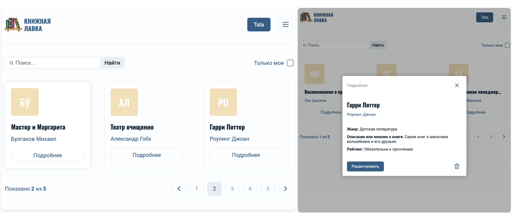
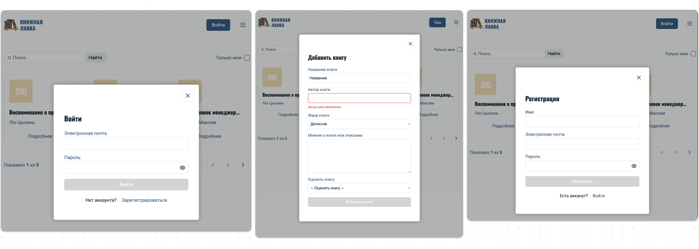

# 📚 Books App - Учет прочитанных книг
**Live Demo:** [https://tatasenochek.github.io/bookshop-app](https://tatasenochek.github.io/bookshop-app)

### Описание проекта

Пет-проект "📚 Books Shop" - это SPA-приложение для учета прочитанных книг с возможностью:
- Полноценной авторизации;
- Просмотра коллекции книг всех пользователей;
- Добавления и управления личной библиотекой;
- Поиска и фильрации книг;

**Цель проекта:** Практическая реализация современных подходов к разработке React-приложений:
- Работа с CRUD-операциями через RTK Query
- Реализация системы аутентификации
- Оптимизация производительности

## Технологический стек

Основные технологии:
- React 18 (хуки, lazy loading)
- TypeScript (полная типизация проекта)
- Redux Toolkit + RTK Query (состояние и кеширование запросов)
- Supabase (PostgreSQL + Authentication)

Дополнительные библиотеки:

| Библиотека          | Применение                          | Причина выбора                     |
|---------------------|------------------------------------|-----------------------------------|
| React Router DOM 6   | Навигация с модальными окнами       | Поддержка Data API                |
| React Hook Form + Zod| Валидация 5+ форм                   | Производительность + TypeScript   |
| Headless UI          | Доступные модальные окна            | Гибкость стилизации               |
| Lucide Icons        | Иконки                              | Оптимизированный размер           |

## Реализованный функционал

Что реализовано в проекте:
- UX/UI дизан проекта;
- Полноценная авторизация;
- CRUD-операции для авторизованных пользователей;
- Фильтрация и поиск с индексацией в Supabase;
- Получение подробной информации о книге;
- Оптимизация производительности; 
 
### Задачи выполненные на проекте

- Разработала дизайн проекта;
- Реализовала адаптивную вёрстку используя CSS-модули и SCSS;
- Подключила Supabase в качестве бекэнда к проекту;
- Настроила маршруты использованием react-router-dom;
- Настроила авторизацию через сервис Authentication в Supabase;
- Реализовала механизм защищенных маршрутов (RequireAuth);
- Реализовала получение данных по разным критериям (все книги/ мои книги);
- Реализовала поиск и фильтрацию книг;
- Реализовала пагинацию на стороне сервера;
- Реализовала CRUD-операции для авторизированного пользователя;
- Подключила и настроила Redux Toolkit для усправления состоянием приложения;
- Реализовала модальные окна и настроила их работу;
- Реализовала взаимодействие с Supabase через RTK Query;
- Настроила кэширование и инвалидацию;
- Реализовала валидацию всех форм;
- Настроила чанки для разделения общего бандла;
- Настроила ленивую загрузку компонентов;

## Производительность

С помощью React Profiler была измерена производительность:
- Главная страница: 3.6ms полного рендера
- Компоненты:
  - `CardBook`: 0.4ms
  - `Search`: 0.2ms 
  - `Pagination`: 0.3ms
- Маршрутизация: 0.5ms на переключение страниц
- Redux: <0.1ms на обновление состояния

### Установка и запуск

Для установки и запуска проекта необходимо выполнить команды

```
yarn 
yarn start 
yarn build
```

или

```
npm install 
npm run start 
npm run build
```

### Скриншоты приложения

Здесь представлены скриншоты интерфейса приложения:



