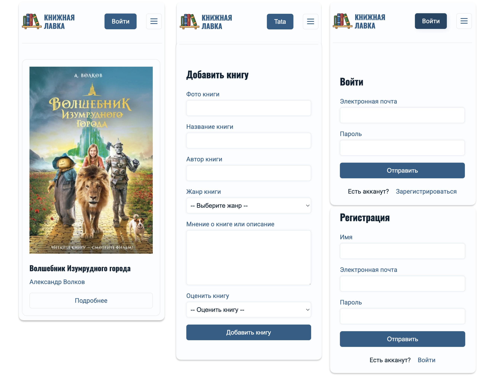
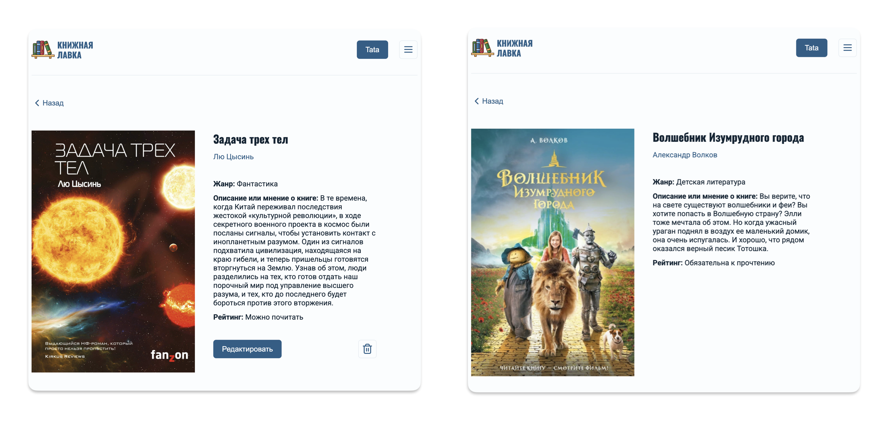

# 📚 Books Shop App

Пет-проект "📚 Books Shop" - это веб-приложение что-бы делиться своим мнением о прочитанных книгах. Посмотреть демо-проекта можно по ссылке https://tatasenochek.github.io/bookshop-app

### Описание проекта

Данный проект выполнялся для отработки CRUD операций, изучения процесса авторизации и аутентификации. Идея и дизайн проекта авторские. 

Что реализовано в проекте:
- Авторизация пользователя по электронной почте;
- Получение списка всех/пользователя книг с сервера;
- Получение подробной информации о книге;
- Редактирование добавленной книги или ее удаление;
 
### Задачи выполненные на проекте

- Разработала дизайн проекта;
- Реализовала адаптивную вёрстку используя CSS-модули и SCSS;
- Подключила Firabase в качестве бекэнда к проекту;
- Настроила маршруты использованием react-router-dom;
- Настроила авторизацию через сервис Authentication в Firabase;
- Реализовала механизм защищенных маршрутов;
- Реализовала получение данных по разным критериям (все книги/ мои книги);
- Реализовала добавление, редактирование и удаление своих книг;
- Подключила и настроила Redux Toolkit для усправления состоянием приложения;
- Реализовала asyncThunk для асинхронного взаимодействия с API.

### Установка и запуск
Для установки и запуска проекта необходимо выполнить команды

```
yarn 
yarn start 
yarn build
```

или

```
npm install 
npm run start 
npm run build
```

### Скриншоты приложения

Здесь представлены некоторые скриншоты интерфейса приложения:

#### Главная страница


#### Мобильная адаптация и формы


#### Страница книги

